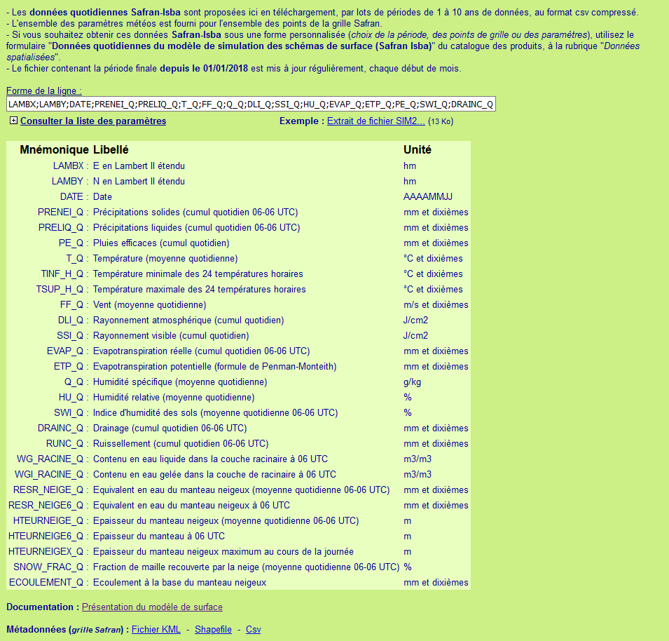

```{r, include = FALSE}
knitr::opts_chunk$set(
  collapse = TRUE,
  comment = "#>"
)
```

```{r setup}
library(safranpack)
```

## Format des données Safran ISBA

Les données quotidiennes Safran-Isba proposées par Meteo France sont téléchargeables sur le site <https://publitheque.meteo.fr/> à condition de disposer d'un compte Publithèque Météo France.

Les données sont distribuées sous forme de fichier `.csv.gz` : CSV compressé en *GunZip*. 

Une fois décompressé, les fichiers peuvent atteindre 4 Go. Pour pouvoir ouvrir et lire un tel volume de données dans R, il faut utiliser le package `data.table`. 

Le package `safranpack` propose des fonctions pour filtrer les données par variable, par date, ou par lieu. 

Les données issues de Safran couvre la métropole avec une grille de points espacés de 8km. Des fonctions sont proposées pour transformer les tableaux de données de type SIG :

- en grille vecteur de type point
- ou en grille raster avec des pixels centrés sur les points Safran

## Documentation Safran

[Présentation du modèle de surface (.pdf)](https://donneespubliques.meteofrance.fr/client/document/doc_sim2_donneespubliques_221.pdf)

[Métadonnées grille Safran (.kml)](https://publitheque.meteo.fr/serveur/grilles/SIM2_kml.zip)

[Métadonnées grille Safran (.csv)](https://publitheque.meteo.fr/serveur/grilles/coordonnees_grille_safran_lambert-2-etendu.zip)

Extrait de fichier : <https://publitheque.meteo.fr/serveur/grilles/Demo_SIM2_2018_20180331.csv>

## Détail des variables

|Mnémonique|Libellé|Unité|
|----------|-------|-----|
|LAMBX | E en Lambert II étendu | hm|
|LAMBY | N en Lambert II étendu | hm|
|DATE | Date | AAAAMMJJ|
|PRENEI_Q | Précipitations solides (cumul quotidien 06-06 UTC) | mm et dixièmes|
|PRELIQ_Q | Précipitations liquides (cumul quotidien 06-06 UTC) | mm et dixièmes|
|PE_Q | Pluies efficaces (cumul quotidien) | mm et dixièmes|
|T_Q | Température (moyenne quotidienne) | °C et dixièmes|
|TINF_H_Q | Température minimale des 24 températures horaires | °C et dixièmes|
|TSUP_H_Q | Température maximale des 24 températures horaires | °C et dixièmes|
|FF_Q | Vent (moyenne quotidienne) | m/s et dixièmes|
|DLI_Q | Rayonnement atmosphérique (cumul quotidien) | J/cm2|
|SSI_Q | Rayonnement visible (cumul quotidien) | J/cm2|
|EVAP_Q | Evapotranspiration réelle (cumul quotidien 06-06 UTC) | mm et dixièmes|
|ETP_Q | Evapotranspiration potentielle (formule de Penman-Monteith) | mm et dixièmes|
|Q_Q | Humidité spécifique (moyenne quotidienne) | g/kg|
|HU_Q | Humidité relative (moyenne quotidienne) | %|
|SWI_Q | Indice d'humidité des sols (moyenne quotidienne 06-06 UTC) | %|
|DRAINC_Q | Drainage (cumul quotidien 06-06 UTC) | mm et dixièmes|
|RUNC_Q | Ruissellement (cumul quotidien 06-06 UTC) | mm et dixièmes|
|WG_RACINE_Q | Contenu en eau liquide dans la couche racinaire à 06 UTC  | m3/m3|
|WGI_RACINE_Q | Contenu en eau gelée dans la couche de racinaire à 06 UTC | m3/m3|
|RESR_NEIGE_Q | Equivalent en eau du manteau neigeux (moyenne quotidienne 06-06 UTC) | mm et dixièmes|
|RESR_NEIGE6_Q | Equivalent en eau du manteau neigeux à 06 UTC | mm et dixièmes|
|HTEURNEIGE_Q | Epaisseur du manteau neigeux (moyenne quotidienne 06-06 UTC) | m|
|HTEURNEIGE6_Q | Epaisseur du manteau à 06 UTC | m|
|HTEURNEIGEX_Q | Epaisseur du manteau neigeux maximum au cours de la journée | m|
|SNOW_FRAC_Q | Fraction de maille recouverte par la neige (moyenne quotidienne 06-06 UTC) | %|
|ECOULEMENT_Q | Ecoulement à la base du manteau neigeux | mm et dixièmes|



## Ouverture du fichier

**Remarque :** selon la documentation de `data.table::fread`, il est possible directement un fichier compressé `.csv.gz` si la package **R.Utils** est installé.

```{r fread}
library(data.table)
# Téléchargement des données de démo MétéoFrance
# Remarque : essayer plutôt les exemples avec les vraies (et volumineuses) données 
# car les données de démo ne contiennent qu'un seul point

URL <- "https://publitheque.meteo.fr/serveur/grilles/Demo_SIM2_2018_20180331.csv"
download.file(URL,"Demo_SIM2_2018_20180331.csv")

f_safran <- "Demo_SIM2_2018_20180331.csv"
DT_safran <- fread(f_safran, header = TRUE)
```

## Exemples d'utilisation 

```{r exemple}

# ##### EXEMPLES D'UTILISATION #####
library(raster)
library(sf)


# ---- exemple 1 : process raster (1 jour, 1 variable, tte la France) ----
# temperature moyenne
raster_tm_0209 <- DT2rast("20180209", DT_safran, "T_Q")
# precipitation
raster_rr_0703 <- DT2rast("20180209", DT_safran, "PRELIQ_Q")

writeRaster(raster_tm_0703, "tm_france_20180209.tif")
writeRaster(raster_rr_0703, "rr_france_20180209.tif")

# # etendue de l'Occitanie en Lambert 2 etendu ?
# sf_reg <- st_read("regions-20180101-shp/regions-20180101.shp")
# sf_occ <- sf_reg[sf_reg$nom=="Occitanie",]
# sf_occ_l2 <- st_transform(sf_occ, 27572)
# # etendue format xmin, ymin, xmax, ymax
# etendue <- st_bbox(sf_occ_l2)
# # dates debut et fin
# jour1 <- as.Date("2014-01-01")
# jourN <- as.Date("2014-12-31")
# 
# # ---- exemple 2 : process stack (multitemporel, 1 variable, etendue region) ----
# 
# stack_tn <- safran2rast(DT_safran, varname="TINF_H_Q", d_date=jour1, f_date=jourN, 
#                         etendue_l2e=etendue)
# stack_tx <- safran2rast(DT_safran, varname="TSUP_H_Q", d_date=jour1, f_date=jourN, 
#                         etendue_l2e=etendue)
# stack_rr <- safran2rast(DT_safran, varname="PRELIQ_Q", d_date=jour1, f_date=jourN, 
#                         etendue_l2e=etendue)
# 
# writeRaster(stack_tn, "output_safran/tn_occitanie_2014.tif", overwrite=T)
# writeRaster(stack_tx, "output_safran/tx_occitanie_2014.tif", overwrite=T)
# writeRaster(stack_rr, "output_safran/rr_occitanie_2014.tif", overwrite=T)


# ---- exemple 3 : process grille points (1 jour, N variables, tte la France) ----
# 
# pts_20180201 <- DT2sp("20140929", DT_safran)
# #pts_20180201$name <- paste(pts_20180201$LAMBX, pts_20180201$LAMBY, sep="_")
# st_write(pts_20180201, "output_safran/data_20140929.shp", delete_layer = T)

```

